# 12 Steps to Navier-Stokes Equations

## **Challenge**

Use computing capabilities of Python to solve the nonlinear coupled partial derivative equations that govern the dynamics of fluids, the Navier-Stokes equations.

## **Actions**

* creating implicit numerical schemes to solve ever increasing difficult components of the NS equations
* linear convection:

* nonlinear convection:

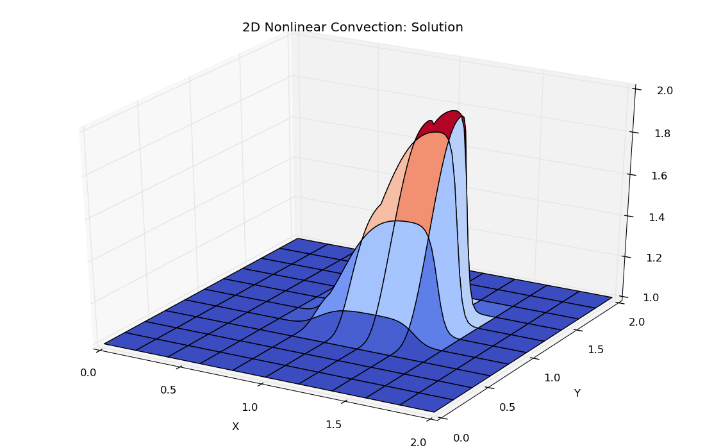

* diffusion:

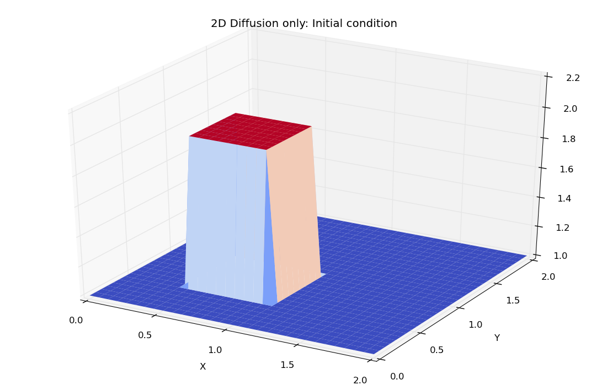

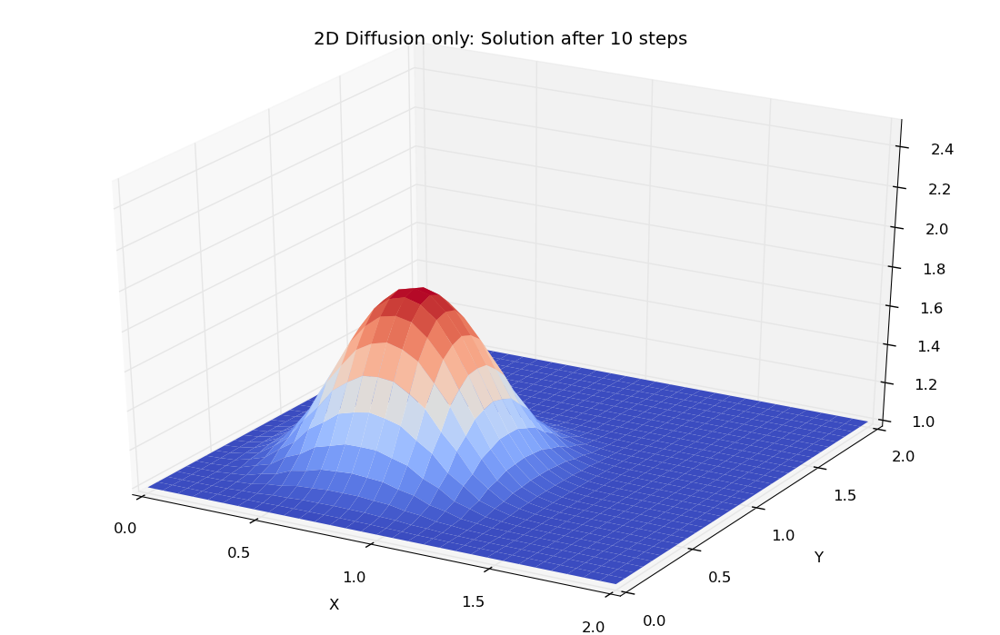

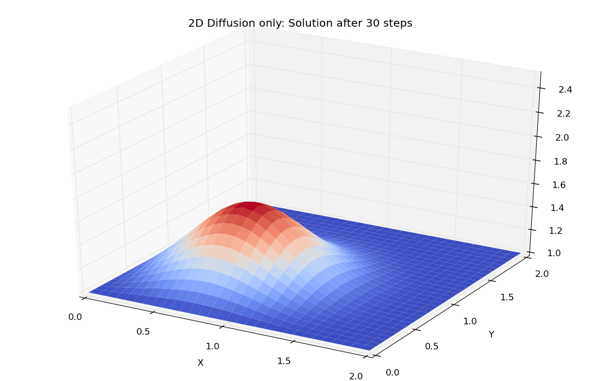

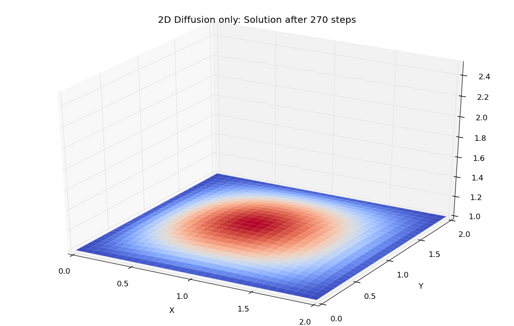

* Burgers' equation

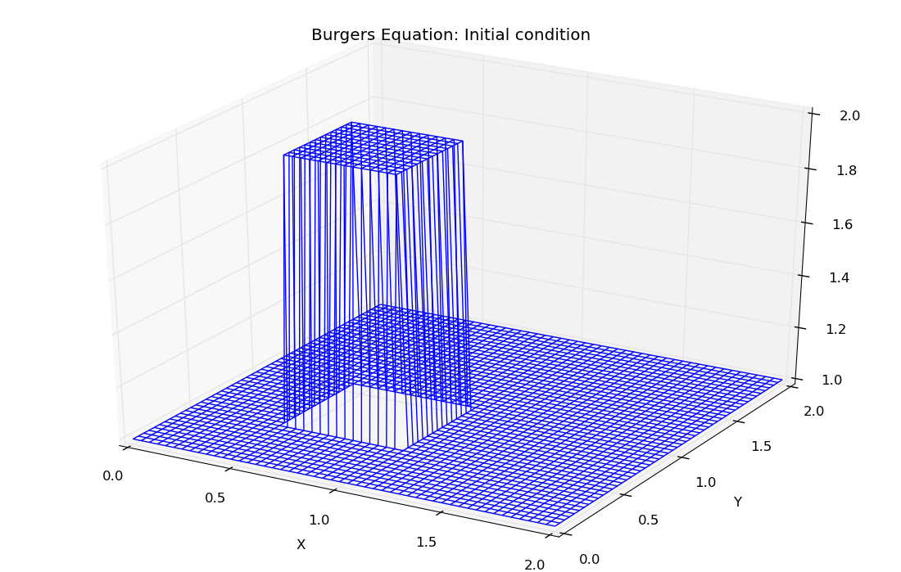

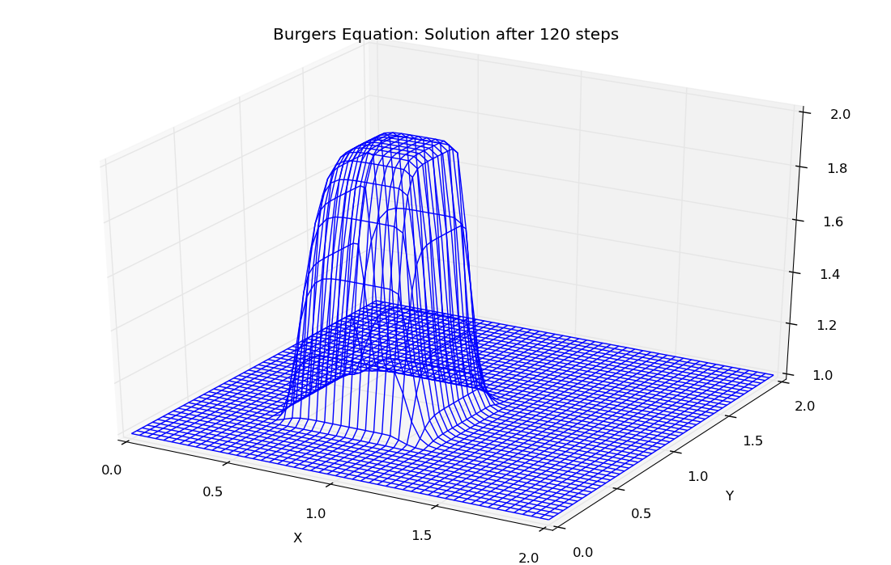

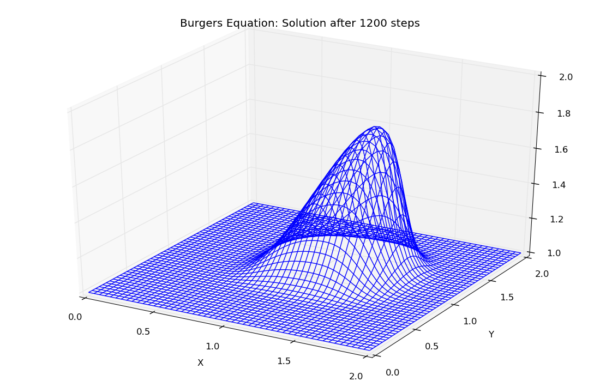

* cavity flow

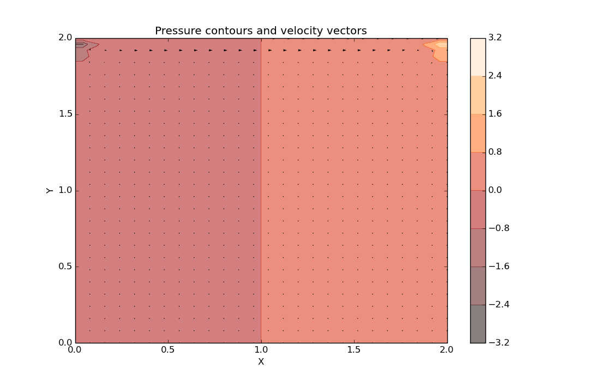

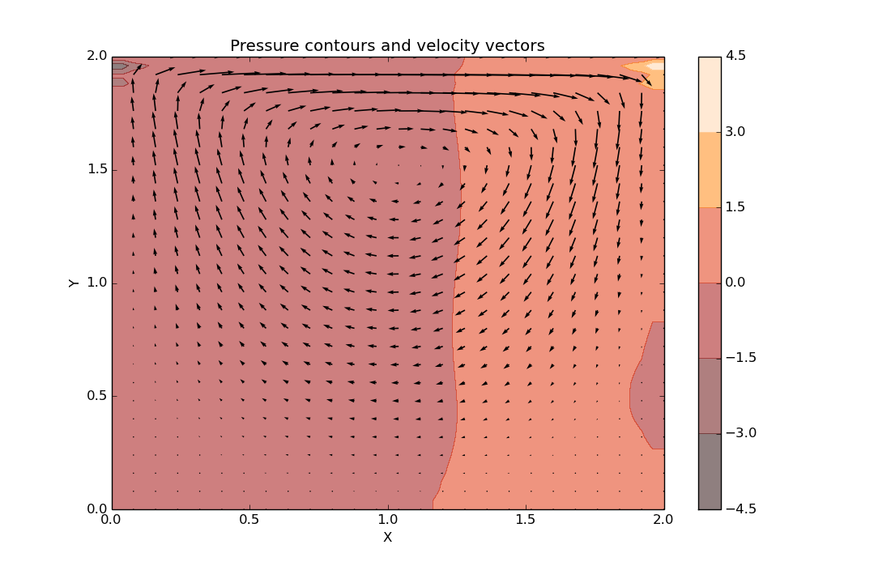

* channel flow

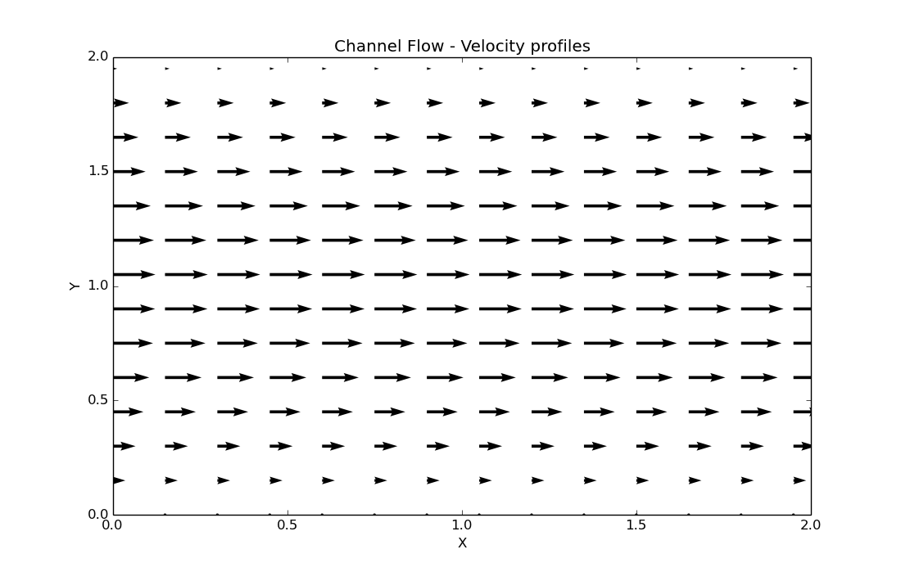

## **Results**

The result of this exercise was package of numerical solutions to the difficult equations of fluid dynamics; the implementation is only in 2D and can solve any problem that can be formulated in a structured 2D mesh; the main equations take also into account turbulence and as seen in the results of teh cavity problem, turbulence is modelled implicitly in the solutions of this project.

For a complete overview of this project please visit its dedicated repository on github:     [https://github.com/FlorinGh/12-steps-to-navier-stokes](https://github.com/FlorinGh/12-steps-to-navier-stokes)​.

