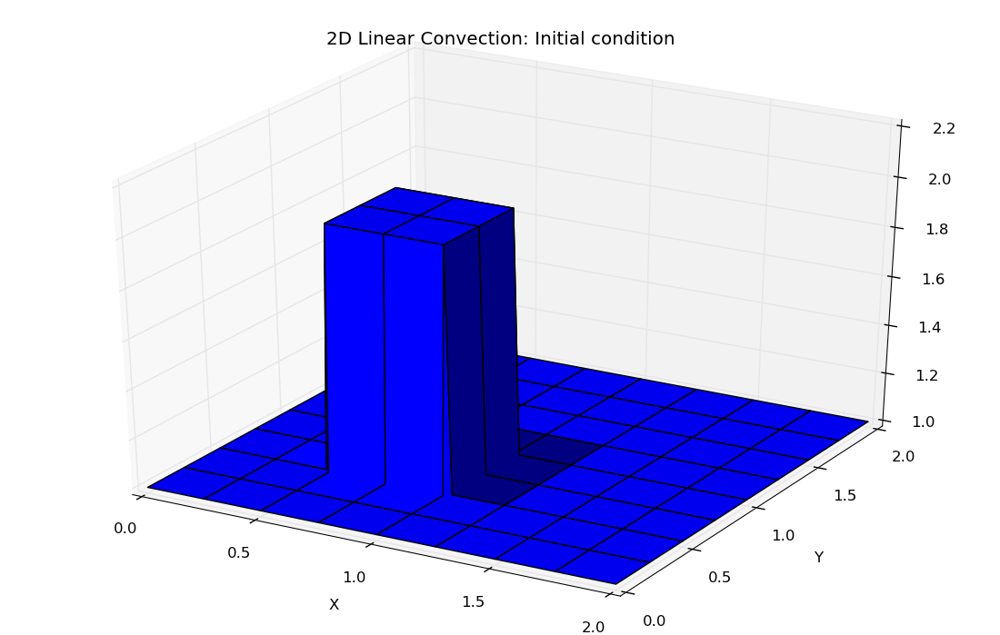
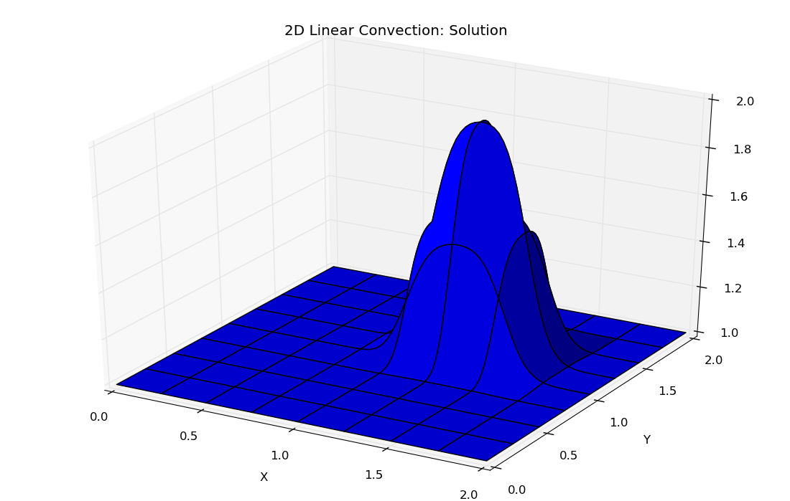

# 12 Steps to Navier-Stokes Equations

## **Challenge**

Use computing capabilities of Python to solve the nonlinear coupled partial derivative equations that govern the dynamics of fluids, the Navier-Stokes equations.

## **Actions**

* creating implicit numerical schemes to solve ever increasing difficult components of the NS equations
* linear convection

* nonlinear convection

* diffusion

* Burgers' equation

* Laplace equation

* Poisson equation

* combine all schemes to solve two classical problems:

  * cavity flow

  * channel flow

## **Results**

 [https://github.com/FlorinGh/12-steps-to-navier-stokes](https://github.com/FlorinGh/12-steps-to-navier-stokes)​

