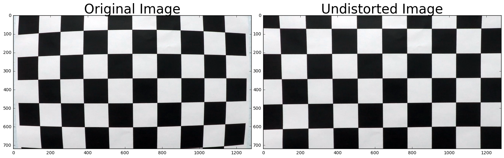
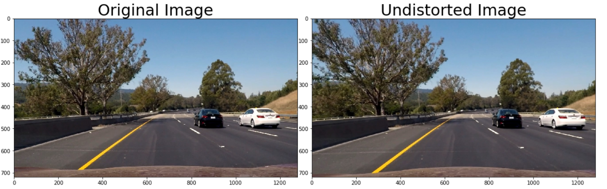
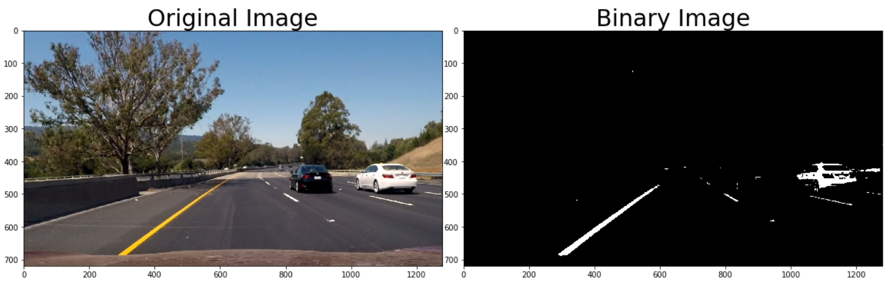
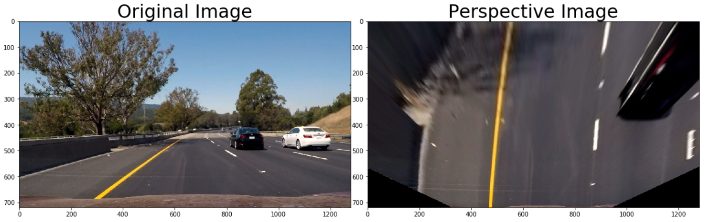
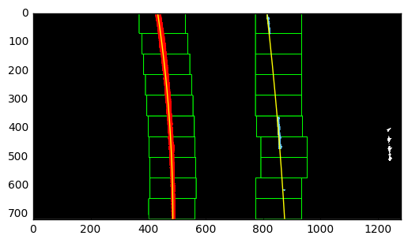
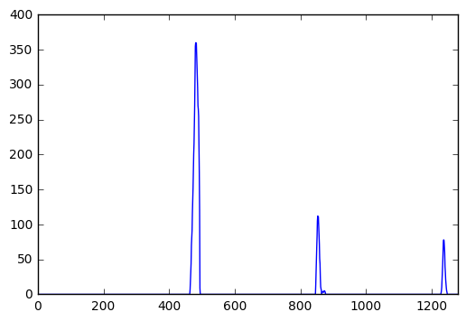
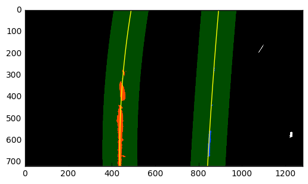
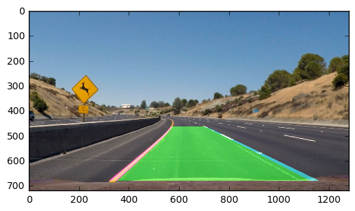
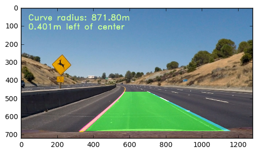

# Advanced Lane Finding

## **Challenge**

The goal of this project was to create a pipeline that would analyse data in traffic video; the output is a video showing the area between the lane lines, the curvature of the road and position of the car; in production autonomous car projects, the curvature can be used to determine the steering angle and location can be used as a correction for the car position between the lines.


## **Actions**

* compute the camera calibration matrix and distortion coefficients given a set of chessboard images.
* apply a distortion correction on the video frames and save a corrected video
* use colour transforms and gradients to create a threshold binary image
* apply a perspective transform to rectify binary image \("birds-eye view"\)
* detect lane pixels and fit to find the lane boundary
* determine lane curvature and vehicle position with respect to centre of curvature
* warp the detected lane boundaries back onto the original perspective
* output visual display of the lane boundaries and numerical estimation of lane curvature and vehicle position.

### Tools

This project used a combination of Python, numpy, matplotlib, openCV and moviepy; this is by definition a computer vision project. These tools are installed in a anaconda environment and ran in a Jupyter notebook.

The complete project implementation is available here: [https://github.com/FlorinGh/SelfDrivingCar-ND-pr4-Advanced-Lane-Lines](https://github.com/FlorinGh/SelfDrivingCar-ND-pr4-Advanced-Lane-Lines).

### Camera Calibration

The code for this step is contained in cells 2-7 of the Jupyter notebook `Advanced-Lane-Lines-Project.ipynb`.

The OpenCV functions `findChessboardCorners` and `drawChessboardCorners` are used to locate and visualise the squares corners. A number of images of a 9x6 chessboard, taken from different angles with the same camera, comprise the input. For each image, the corners are identified and stored in a list of points; using another generated list of 3D points \(essentially indices\) and the openCV function `calibrateCamera`, we obtain the camera calibration matrix, which is actually a 3x3 matrix; along with it we also get the distortion coefficients \(radial and tangential\).

These are then used in the OpenCV function `undistort`, cells 8 and 9, to undo the effects of distortion on any image produced by the same camera. Generally, these coefficients will not change for a given camera \(and lens\).

The image below depicts the results of applying `undistort`, using the calibration and distortion coefficients, to one of the chessboard images:



### Distortion correction

The image below depicts the result of applying `undistort` to one of the project test images:



The effect of `undistort` is perceived from the difference in shape of the hood of the car at the bottom corners of the image and the shape and size of the tree at the top left corner.

### Colour transforms and gradients

Several methods were available as show in the course lecture; after testing different procedures, only the most reliable were kept; as rule of thumb, in variable lighting condictions the best colorspace to use is HLS; channels L and S have proven to pick up lane lines in variable lightness conditions; see cells 13 and 14 in project notebook.

A new colorspace was introduce, Lab; this color space describes mathematically all perceivable colors in the three dimensions L for lightness and a and b for the color components green–red and blue–yellow; therefore the yellow line will be properly picked up using the b channel; see cell 15.

A function combining these channels was created and ran against test images, see cell 16. The next image is a comparison between the original and the binary for a test image:



### Perspective transform

The perspective transform is created using the `unwarp()` function that takes as inputs an image \(`img`\); this basically distorts the image in controlled manner using two sets of points: source \(`src`\) and destination \(`dst`\); the idea behind this is that we know that the source points should be a rectangle; making sure the destination points define a rectangle, the whole image is distorted to match the two zones. I used the following source and destination points:

| Source | Destination |
| :---: | :---: |
| 575, 464 | 450, 0 |
| 707, 464 | 830, 0 |
| 258, 682 | 450, 720 |
| 1049, 682 | 830, 720 |

I verified that my perspective transform was working as expected by drawing the test images and its warped counterpart to verify that the lines appear parallel in the warped image, see cells 10 to 12.



### Detect lane pixels and fit to find the lane boundary

The functions `sliding_window_polyfit` and `polyfit_using_prev_fit`, which identify lane lines and fit a second order polynomial to both right and left lane lines are used to detect pixels and fit a polynomial function using their coordinates.

The first of these computes a histogram of the bottom half of the image and finds the base x position of the left and right lane lines. Originally these locations were identified from the local maxim of the left and right halves of the histogram, but in my final implementation I changed these to quarters of the histogram just left and right of the midpoint. This helped rejecting lines from adjacent lanes. The function then uses ten windows from which to identify lane pixels, each one centred on the midpoint of the pixels from the window below. This effectively "follows" the lane lines up to the top of the binary image, and speeds processing by only searching for activated pixels over a small portion of the image.

Pixels belonging to each lane line are identified and the numpy `polyfit()` method fits a second order polynomial to each set of pixels. The image below demonstrates how this process works:



The image below depicts the histogram generated by `sliding_window_polyfit`; the resulting base points for the left and right lanes are given by the the two peaks nearest the centre:



The `polyfit_using_prev_fit` function performs basically the same task, but alleviates much difficulty of the search process by leveraging a previous fit \(from a previous video frame, for example\) and only searching for lane pixels within a certain range of that fit. The image below demonstrates this - the green shaded area is the range from the previous fit, and the yellow lines and red and blue pixels are from the current image:



### Determine lane curvature and vehicle position

The radius of curvature is based upon [this website](http://www.intmath.com/applications-differentiation/8-radius-curvature.php) and calculated in the code cell titled "Radius of Curvature and Distance from Lane Center Calculation" using this line of code:

```python
curve_radius = ((1 + (2*fit[0]*y_0*y_meters_per_pixel + fit[1])**2)**1.5) / np.absolute(2*fit[0])
```

In this example, `fit[0]` is the first coefficient \(the y-squared coefficient\) of the second order polynomial fit, and `fit[1]` is the second \(y\) coefficient; `y_0` is the y position within the image upon which the curvature calculation is based \(the bottom-most y - the position of the car in the image - was chosen\). `y_meters_per_pixel` is the factor used for converting from pixels to meters. This conversion was also used to generate a new fit with coefficients in terms of meters.

The position of the vehicle with respect to the center of the lane is calculated with the following lines of code:

```python
lane_center_position = (r_fit_x_int + l_fit_x_int) /2
center_dist = (car_position - lane_center_position) * x_meters_per_pix
```

`r_fit_x_int` and `l_fit_x_int` are the x-intercepts of the right and left fits, respectively. This requires evaluating the fit at the maximum y value \(719, in this case - the bottom of the image\) because the minimum y value is actually at the top. The car position is the difference between these intercept points and the image midpoint \(assuming that the camera is mounted at the centre of the vehicle\).

### Warp the detected lane boundaries back onto the original perspective

I implemented this step in the code cells titled "Draw the Detected Lane Back onto the Original Image" and "Draw Curvature Radius and Distance from Centre Data onto the Original Image" in the Jupyter notebook. A polygon is generated based on plots of the left and right fits, warped back to the perspective of the original image using the inverse perspective matrix `Minv` and overlaid onto the original image. The image below is an example of the results of the `draw_lane` function:



Below is an example of the results of the `draw_data` function, which writes text identifying the curvature radius and vehicle position data onto the original image:



### Discussion

Here I'll talk about the approach I took, what techniques I used, what worked and why, where the pipeline might fail and how I might improve it if I were going to pursue this project further.

In terms of the project videos, the most challenging frames are those with low lighting, shadows, different pavement colour, large angles of steering. The pipeline was approachable until the polyfit function; at the moment the code uses results from previous frames in order to average the binary images; this also helps in removing wobbly lines; I had to research blogs and github repos to see a solution, full credit is given to `https://github.com/jeremy-shannon` for Line Class for Storing Data idea.

To make the pipeline more robust we would need to fit the road with higher polynomials; this might solve the harder challenge video. Also, due to rapid changing conditions, a more dynamic thresholding would be required.

## **Results**

All steps described above were captured in a pipeline; applying it over the frames of the traffic video renders the following result:


For more details on this project visit the following github repository: [https://github.com/FlorinGh/SelfDrivingCar-ND-pr4-Advanced-Lane-Lines](https://github.com/FlorinGh/SelfDrivingCar-ND-pr4-Advanced-Lane-Lines).

