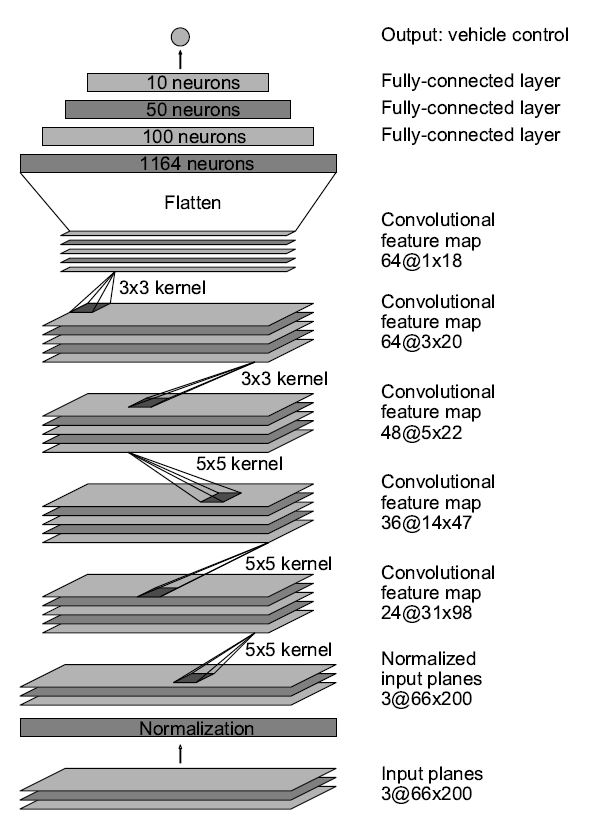

# Behavioural Cloning

## **Challenge**

Train a convolution neural network to clone driving behaviour using training sets recorded in realistic video games.

A driving simulator created in Unity is provided; the user can steer a car around a track using the keyboard or a joystick; in record mode screen shots of the road and steering angles are saved.  Use image data and steering angles to train a neural network and then use this model to drive the car autonomously around the track.

## **Actions**

* use the simulator to collect data of good driving behaviour
* build a convolution neural network in Keras that predicts steering angles from images
* train and validate the model with a training and validation set
* check that the model successfully drives around track without leaving the road

### Tools

This project used a combination of Python, numpy, matplotlib, openCV, scikit-learn and Keras GPU. These tools are installed in a anaconda environment and ran in a Jupyter notebook.

The complete project implementation is available here: [https://github.com/FlorinGh/SelfDrivingCar-ND-pr3-Behavioral-Cloning](https://github.com/FlorinGh/SelfDrivingCar-ND-pr3-Behavioral-Cloning).

### M**odel architecture**

My model consists of the following layers:

* a cropping layer used to crop out the top and bottom parts image of the image as these contained environment and car data
* a lambda layer used to resize and normalise images
* three 5x5 convolution layers with double stride and 'relu' activation
* two 3x3 convolution layers with normal stride and 'relu' activation
* a flatten layer to put all values in a vector
* three fully connected layers
* the output with just a value, that would be the predicted steering angle \(this a regression problem, not a classification ! \) 

### **Attempts to reduce over-fitting in the model**

No dropout layers were used in the model as in the development stage it was observed that accuracy was affected. It could be noted that dropout is not recommended in regression problems.

The normal drive of the track is counter-clockwise; this is also the direction of the test. In order to avoid overfitting, the model was trained on data collected driving in clockwise direction, ensuring the test will be run on completely new images.

Second, to avoid over-fitting, the recorded data was split in trained and validated data sets.

Third when recording screen shots of the road are taken in three location at a certain time; that is for a given steering angle we have a central, left and right image; the steering angle is for the central image and would be appropriate for the other too; during driving, most of the data has zero steering and good position of he car on the road; it was noticed that \(as people can't learn much if everything works, but learn a lot from challenges\) learning from central images with zero steering will make it very hard for the model to know what to do at curbs.

Therefore in modelling my network I ignored central images and used only the left and right images; to make sure the car steers correctly a correction was applied to the recorder steering, symmetrical to left and right images; this correction was determined through trial an error.

Fourth, in order to have enough training data, 10 laps were recorded; after data training data was augmented using mirrored images of the actual data; this doubled the training set at zero cost.

### P**arameters tuning**

The model used an adam optimizer, so the learning rate was not tuned manually. The angle correction was tunned to ensure the steering is decisive enough: at small values of corr, the car was steering slow and at sharp corners was getting out of the track.

After the collection process, I had 9864 number of data points. I finally randomly shuffled the data set and put 20% of the data into a validation set.

I used this training data for training the model. The validation set helped determine if the model was over or under fitting. The ideal number of epochs was 3 as evidenced by the stagnating loss.

### Training Strategy

The overall strategy for deriving a model architecture was to use the knowledge I gathered in the course and come to a first solution; afterwards build on it and improve the solution. I first used an architecture close to LeNet but it was not powerful enough; with this occasion I realised the difference between classification and regression \(at first my care was outputting only one steering angle\).

After that I start changing the model to what was actually very close to the one in the Nvidia paper. This is the model that I refined and I am going to explain in more detail in the following lines.

My first step was to create the generator; even if I have a really powerful computer, I wanted to understand how generators work; the conclusion is this trick is useful for large data sets, but it take a much longer time to train a network than storing all the data in the memory; so if memory is not a problem, generators should be avoided as they slow down learning.

The second step was to create the model. The first layer is cropping the images to keep only the relevant data; it's important to do this _in the model_, as it has to be done also on the test, when the car will actually drive by itself.

The second layer uses the power of lambda functions to resize the images; this is of crucial importance as it affects the final size of the model; without resizing the model was 3 times larger. From this point on I used the Nvidia model: three 5x5 convolution layers with double stride and 'relu' activation, two 3x3 convolution layers with normal stride and 'relu' activation, a flatten layer to put all values in a vector, three fully connected layers, the output with just a value, that would be the predicted steering angle.

In order to gauge how well the model was working, I split my image and steering angle data into a training and validation set. The errors were very close between the training set and validation set at each epoch, which suggested that the model was not over-fitting.

The final step was to run the simulator to see how well the car was driving around the track. There were a few spots where the vehicle fell off the track and I improved that by increasing the correction for steering angle.

At the end of the process, the vehicle is able to drive autonomously around the track without leaving the road.

The final model architecture consisted of a convolution neural network. Here is a visualisation of the architecture, with the layers and layers sizes:

## **Results**

The model was tested by running it through the simulator and ensuring that the vehicle could stay on the track; in the end the car had no error on the track:

[https://github.com/FlorinGh/SelfDrivingCar-ND-pr3-Behavioral-Cloning](https://github.com/FlorinGh/SelfDrivingCar-ND-pr3-Behavioral-Cloning)

