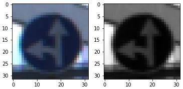
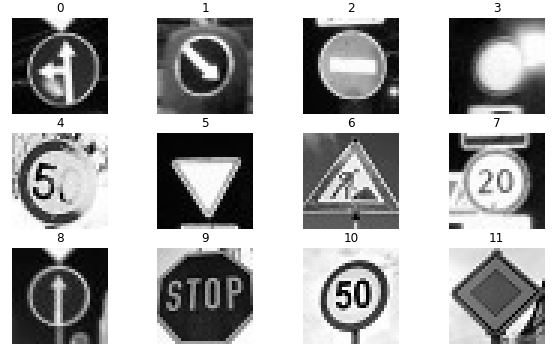
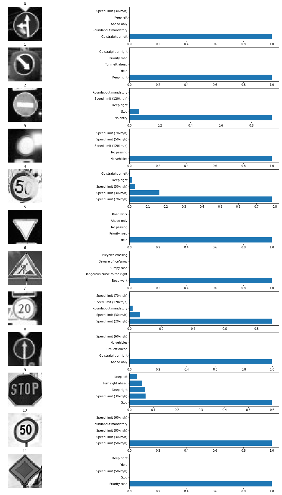

# Traffic Signs Classifier

## Challenge

Train a convolution neural network to classify traffic signs images using the [German Traffic Sign Data set](http://benchmark.ini.rub.de/?section=gtsrb&subsection=dataset); with the trained model classify traffic signs from the web.


## Actions

* install anaconda, setup an environment, install pandas, pickle,  tensorflow and openCV
* explore, summarise and visualise the data set
* design, train and test a model architecture
* use the model to make predictions on new images
* analyse the softmax probabilities of the new images

### Tools

This project used a combination of Python, pandas, matplotlib, openCV and tensorflow gpu. These tools are installed in a anaconda environment and ran in a Jupyter notebook.

The complete project implementation is available here: [https://github.com/FlorinGh/SelfDrivingCar-ND-pr2-Traffic-Signs-Classifier/blob/master/Traffic\_Sign\_Classifier.ipynb](https://github.com/FlorinGh/SelfDrivingCar-ND-pr2-Traffic-Signs-Classifier/blob/master/Traffic_Sign_Classifier.ipynb).

### Data Set Summary and Exploration

The data provided was already split in train, validation and test; using a few lines of code we inspect the data set:

```python
# Number of training examples
n_train = X_train.shape[0]

# Number of validation examples
n_validation = X_valid.shape[0]

# Number of testing examples
n_test = X_test.shape[0]

# What's the shape of an traffic sign image?
image_shape = X_train.shape[1:3]

# How many unique classes/labels are in the dataset?
n_classes = 1 + y_train.max()
```

* The size of training set is 34799
* The size of the validation set is 4410
* The size of test set is 12630
* The shape of a traffic sign image is 32 x 32 pixels
* The number of unique classes/labels in the data set is 43

The data is composed of 32 x 32 pixel images containing traffic signs; there are 43 different traffic signs; each type will be assign a number from 0 to 42 representing the class ID; we will train a model to estimate the ID based on the input image; then, with the predicted ID we can search in a table the corresponding sign name.

A bin chart was created to visualise the train, validation and test sets:

* this chart works a frequency plot: it shows how many example we have for each of the classes
* for any given set, the distribution is not uniform between classes; but this distribution is kept for all sets; this will ensure that the train will not bias the model toward a specific class


### Design and Test a Model Architecture

The starting point for this project was LeNet-5 architecture with a change in pre-processing and the number of classes; given the training accuracy with the original architecture was below the accepted threshold, some improvements have been made; training was performed using tensorflow-gpu 1.6.

Preprocessing consisted in:

* grayscale all images to remove the complexity of a 3 layer data to one; it was noticed that the colour information adds complexity with no additional accuracy; furthermore, using grayscale images significantly improves learning speed

```python
# Grayscale
import cv2

X_trainG = np.zeros(shape=(len(X_train),32,32))
for i in range(len(X_train)):
    X_trainG[i]= cv2.cvtColor(X_train[i].squeeze(), cv2.COLOR_RGB2GRAY)
```



* normalisation: we have to make sure the data has mean zero and equal variance; given the images are now grayscale, each pixel has a value between 0 and 255; applying `(pixel - 128)/128` is a quick way to approximately normalise the data; normalising images increased accuracy with about 3.5% and improved learning speed

```python
# Normalization
X_train = (X_train_gray-128.0)/128.0
X_valid = (X_valid_gray-128.0)/128.0
X_test = (X_test_gray-128.0)/128.0
```

* shuffle: random learning ensures better model accuracy; random state ensures the same random distribution is achieved every time the code is ran; this helps in assessing improvements between two different runs

```python
# Shuffle data
from sklearn.utils import shuffle
X_train, y_train = shuffle(X_train, y_train, random_state=23)
```

An iterative approach was taken in order to design the neural network:

* started from the **LeNet-5** architecture and tested it on the coloured images, with an accuracy of 88.1%; I chose the LeNet-5 because it was the single complete net that I've used successfully before.
* this architecture was actually created for a simpler problem, MNIST, with only one channel of data and only 10 classes; so it was expected to have lower accuracy than on MNIST
* trying to improve accuracy I first did a couple of studies to see the effect of changing the **batch size** and **learning rate** on the accuracy; decided that 128 and 0.001 were the best values
* then I switched to **tensorflow-gpu** and increased the number of epochs from 10 to 300 and this gave an improvement of about 2%, getting to 90.2%
* then I applied **normalisation**, which increased the accuracy by another 3.6%, getting to 93.8% on the test data, and 95% on the validation data; these values are above the threshold for submitting, but I knew I could do better
* applying **grayscale** didn't improve much the accuracy, I only won a bit on speed
* the last bit I added in is **dropout**; added this on all layer except the first and last, dropout probability was 0.75 for training and 1.0 for evaluations; this increased accuracy to 95.0% on test set.
* **Lessons learned**: colours don't matter much in the machine world; always normalise to make all numbers in the same range \(this gave the biggest improvement in accuracy\); use dropout, make it harder to train in order to make in easier at the test

The final architecture consisted of the following layers:

| **Layer** | **Description** |
| :---: | :---: |
| Input | 32x32x1 Random, grayscale, normalised image |
| Convolution 5x5 | 1x1 stride, valid padding, outputs 28x28x6 |
| RELU | Activation |
| Max pooling | 2x2 stride, valid padding, outputs 14x14x6 |
| Convolution 5x5 | 1x1 stride, valid padding, outputs 10x10x16 |
| RELU | Activation |
| Max pooling | 2x2 stride, valid padding, outputs 5x5x16 |
| Flatten | Outputs 400 |
| Dropout | Ignore 25% of outputs |
| Fully connected | Outputs 120 |
| RELU | Activation |
| Dropout | Ignore 25% of outputs |
| Fully connected | Outputs 84 |
| RELU | Activation |
| Dropout | Ignore 25% of outputs |
| Fully connected | Outputs 43 |
| Softmax | Outputs 43 |

```python
def LeNet(x):    
# Layer 1:
    #Convolutional. Input = 32x32x1. Output = 28x28x6.
    # Filter size = H + 2*P - (h-1)*S = 32 + 2*0 - (28-1)*1 = 32 + 0 - 27 = 5
    wL1 = tf.Variable(tf.truncated_normal([5,5,1,6], mean=mu, stddev=sigma))
    bL1 = tf.Variable(tf.truncated_normal([6], mean=mu, stddev=sigma))
    layer1 = tf.nn.conv2d(x, wL1, strides=[1,1,1,1], padding='VALID')
    layer1 = tf.nn.bias_add(layer1, bL1)
    
    # Activation.
    layer1 = tf.nn.relu(layer1)
    
    # Pooling. Input = 28x28x6. Output = 14x14x6.
    layer1 = tf.nn.max_pool(layer1, ksize=[1,2,2,1], strides=[1,2,2,1], padding='VALID')
    
# Layer 2:
    # Convolutional. Input = 14x14x6. Output = 10x10x16.
    # Filter size = H + 2*P - (h-1)*S = 14 + 0 - 9 = 5
    wL2 = tf.Variable(tf.truncated_normal([5,5,6,16], mean=mu, stddev=sigma))
    bL2 = tf.Variable(tf.truncated_normal([16], mean=mu, stddev=sigma))
    layer2 = tf.nn.conv2d(layer1, wL2, strides=[1,1,1,1], padding='VALID')
    layer2 = tf.nn.bias_add(layer2, bL2)
    
    # Activation.
    layer2 = tf.nn.relu(layer2)
    
    # Pooling. Input = 10x10x16. Output = 5x5x16.
    layer2 = tf.nn.max_pool(layer2, ksize=[1,2,2,1], strides=[1,2,2,1], padding='VALID')
    
    # Flatten. Input = 5x5x16. Output = 400.
    layer2 = flatten(layer2)
    layer2 = tf.nn.dropout(layer2, keep_prob)
    
# Layer 3:
    # Fully Connected. Input = 400. Output = 120.
    wL3 = tf.Variable(tf.truncated_normal([400, 120], mean=mu, stddev=sigma))
    bL3 = tf.Variable(tf.truncated_normal([120], mean=mu, stddev=sigma))
    layer3 = tf.add(tf.matmul(layer2, wL3), bL3)
    
    # Activation.
    layer3 = tf.nn.relu(layer3)
    layer3 = tf.nn.dropout(layer3, keep_prob)
        
# Layer 4:
    # Fully Connected. Input = 120. Output = 84.
    wL4 = tf.Variable(tf.truncated_normal([120,84], mean=mu, stddev=sigma))
    bL4 = tf.Variable(tf.truncated_normal([84], mean=mu, stddev=sigma))
    layer4 = tf.add(tf.matmul(layer3, wL4), bL4)
    
    # Activation.
    layer4 = tf.nn.relu(layer4)
    layer4 = tf.nn.dropout(layer4, keep_prob)
        
# Layer 5: Output
    # Fully Connected. Input = 84. Output = 43.
    wL5 = tf.Variable(tf.truncated_normal([84,43], mean=mu, stddev=sigma))
    bL5 = tf.Variable(tf.truncated_normal([43], mean=mu, stddev=sigma))
    logits = tf.add(tf.matmul(layer4, wL5), bL5)
    
    return logits
```

Training setup:

* epochs: 50
* batch size: 128
* learning rate: 0.001
* dropout during training set to 0.75 and changed to 1.0 when evaluating against validation and test data sets
* optimizer: AdamOptimizer.

My final model results were:

* training set accuracy of 99.9%
* validation set accuracy of 95.5%
* test set accuracy of 95.0%


### Test a Model on New Images

To test my model I used 12 traffic signs that were not in the original data set:




Image no.4 might be difficult to classify because half of the sign is covered in snow. In the table below are listed the predictions using the trained network:

| **Image** | **Prediction** |
| :---: | :---: |
| Go straight or left | Go straight or left |
| Keep right | Keep right |
| No entry | No entry |
| No vehicles | No vehicles |
| Speed limit \(50km/h\) | Speed limit \(70km/h\) |
| Yield | Yield |
| Road work | Road work |
| Speed limit \(20km/h\) | Speed limit \(20km/h\) |
| Ahead only | Ahead only |
| Stop | Stop |
| Speed limit \(50km/h\) | Speed limit \(50km/h\) |
| Priority road | Priority road |

The model was able to correctly guess 11 out of 12 traffic signs, which gives an accuracy of 91.7%. This compares favourably to the accuracy on the test set of 95.0%.

In the following we can see the top 5 softmax probabilities for each of the 12 new traffic signs:



### Visualising the Neural Network

**1. Discuss the visual output of your trained network's feature maps. What characteristics did the neural network use to make classifications?**

While neural networks can be a great learning device they are often referred to as a black box. This is not entirely true as we can look under the hood to see how the data evolves from one layer to another; tensor has the power to map all action under names and we can plot each action to have an idea of what is important at each layer.

Layer to focusses on the complete image taking into account a lot of details; as we goo deeper in the network, the amount of data is smaller for each image and fewer and fewer details are considered.

### 


### 

## Results

[https://github.com/FlorinGh/SelfDrivingCar-ND-pr2-Traffic-Signs-Classifier](https://github.com/FlorinGh/SelfDrivingCar-ND-pr2-Traffic-Signs-Classifier)

