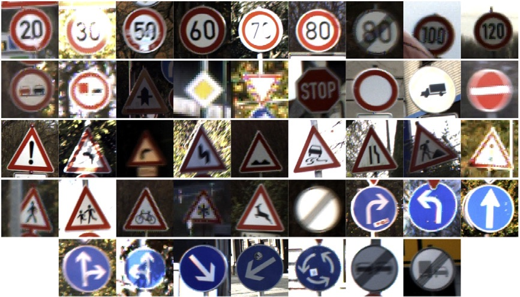

# Traffic Signs Classifier

## Challenge

Train a  convolution neural network to classify traffic signs images using the [German Traffic Sign Data set](http://benchmark.ini.rub.de/?section=gtsrb&subsection=dataset); with the trained model classify traffic signs from the web.

## Actions

* install anaconda, setup an environment, install pandas, pickle,  tensorflow and openCV
* design, train and test a model architecture
* use the model to make predictions on new images
* analyse the softmax probabilities of the new images

## Results

 [https://github.com/FlorinGh/SelfDrivingCar-ND-pr2-Traffic-Signs-Classifier](https://github.com/FlorinGh/SelfDrivingCar-ND-pr2-Traffic-Signs-Classifier)

