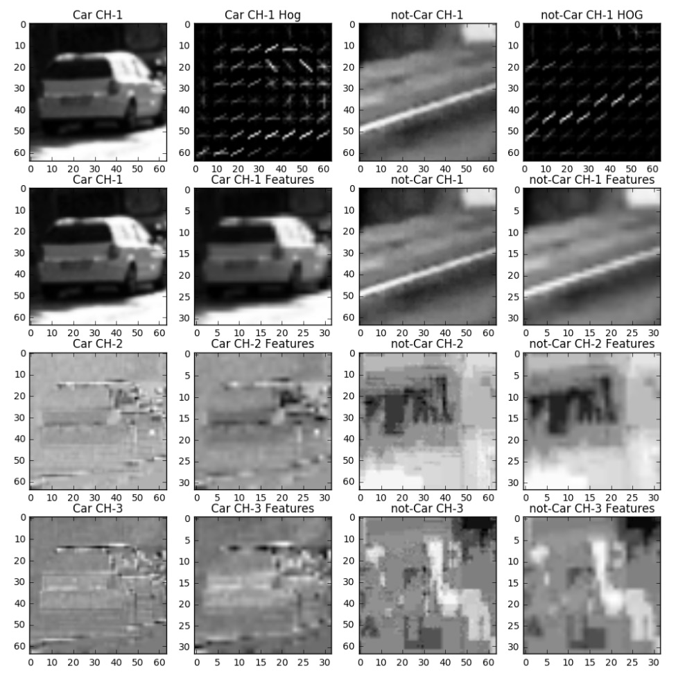

# Vehicle Detection

## **Challenge**

Write a software pipeline to detect vehicles in a traffic video taken while driving on a motorway:

## **Actions**

* Histogram of Oriented Gradients \(HOG\)
  * we have been provided with a set of images: 8968 various traffic images, 8792 images with cars;images are color, 64x64 pixels
  * using HOG and other techniques, extract features of these images
  * separate the images in train/test and train a SVM classifier
* Sliding Window Search
  * implemented a sliding window search and classify each window as vehicle or non-vehicle
  * run the function first on test images and afterwards against project video
* Video Implementation
  * output a video with the detected vehicles positions drawn as bounding boxes
  * implement a robust method to avoid false positives \(could be a heat map showing the location of repeated detection\)

### Tools

This project used a combination of Python, numpy, matplotlib, openCV, scikit-learn and moviepy; this is by definition a computer vision project. These tools are installed in a anaconda environment and ran in a Jupyter notebook.

The complete project implementation is available here: [https://github.com/FlorinGh/SelfDrivingCar-ND-pr4-Advanced-Lane-Lines](https://github.com/FlorinGh/SelfDrivingCar-ND-pr4-Advanced-Lane-Lines).

### Histogram of Oriented Gradients \(HOG\)

The implementation starts with importing the relevant modules for this project; all images were place in the same directory on a local drive; non-car images have been renamed starting with 'traffic'; this helped separate them in car and non-car lists; the data set has 8792 car images and 8968 non-car images; the data set is well balanced and it doesn't need augmentation.

Here is an example of one of each of the `vehicle` and `non-vehicle` classes:

I then explored different colour spaces and different `skimage.hog()` parameters \(`orientations`, `pixels_per_cell`, and `cells_per_block`\). I grabbed random images from each of the two classes and displayed them to get a feel for what the `skimage.hog()` output looks like.

Here is an example using the `YCrCb` color space and HOG parameters of `orientations=8`, `pixels_per_cell=(8, 8)` and `cells_per_block=(2, 2)`:

In order to choose the HOG parameters, I tested different combinations changing only one parameter at a time, on a range of values; the best accuracy would indicate which value to keep and went ahead to test another parameter; below you can see the effect of each parameter, and in bold the one kept for final run.

After that the features of each of the car and non-car image are extracted; these are used to train the linear SVM model; before running the training algorithm the features are normalised using the StandardScaler; then data set is initiated and trained; the resulting test accuracy was 98.51%.

### Sliding Window Search

The next section is the main part of the project: using small windows, each image is searched; data from each window is than tested againts the trained model and a decision is made if it conains a car or not; using several windows we can detect a car in more than one window; this is particulary helpful to reduce false positive cases; using a heat filter we will extract the locations where we the a car was detected more than 5 times, ignoring all other windows.

I searched with 3 window sizes: 90px, 96px and 112px; these were selected after a few trial and error tests:

!\[alt text\]\[image3\]

**2. Show some examples of test images to demonstrate how your pipeline is working.  What did you do to optimize the performance of your classifier?**

Ultimately I searched on two scales using YCrCb 3-channel HOG features plus spatially binned color and histograms of color in the feature vector, which provided a nice result. Here are some example images:

### !\[alt text\]\[image4\]

#### Video Implementation

**1. Provide a link to your final video output.  Your pipeline should perform reasonably well on the entire project video \(somewhat wobbly or unstable bounding boxes are ok as long as you are identifying the vehicles most of the time with minimal false positives.\)**

Here's a [link to my video result](./test_video_output.mp4)

**2. Describe how \(and identify where in your code\) you implemented some kind of filter for false positives and some method for combining overlapping bounding boxes.**

I recorded the positions of positive detections in each frame of the video. From the positive detections I created a heatmap and then thresholded that map to identify vehicle positions. I then used `scipy.ndimage.measurements.label()` to identify individual blobs in the heatmap. I then assumed each blob corresponded to a vehicle. I constructed bounding boxes to cover the area of each blob detected.

Here's an example result showing the heatmap from a series of frames of video, the result of `scipy.ndimage.measurements.label()` and the bounding boxes then overlaid on the last frame of video:

#### Here are six frames and their corresponding heatmaps:

!\[alt text\]\[image5\]

#### Here is the output of `scipy.ndimage.measurements.label()` on the integrated heatmap from all six frames:

!\[alt text\]\[image6\]

#### Here the resulting bounding boxes are drawn onto the last frame in the series:

!\[alt text\]\[image7\]

#### Discussion

**1. Briefly discuss any problems / issues you faced in your implementation of this project.  Where will your pipeline likely fail?  What could you do to make it more robust?**

The most difficult part of the project was elimating the false positives; event we had good accuracy on the test, in the project this didn't seem good enough; this is a sign the training model had overfit the training data; One way to improve the project would be to try another traing model, maybe a neural network.

## **Results**

All steps described above were captured in a pipeline; applying it over the frames of the traffic video renders the following result:

For more details on this project visit the following github repository: [https://github.com/FlorinGh/SelfDrivingCar-ND-pr5-Vehicle-Detection](https://github.com/FlorinGh/SelfDrivingCar-ND-pr5-Vehicle-Detection).

